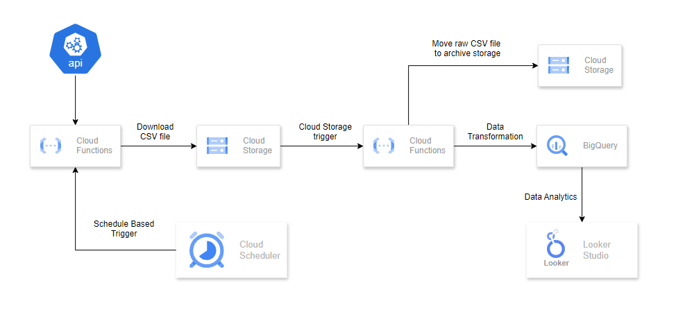

# Supermarket Sales Data Pipeline

This document outlines the steps to extract, transform, and analyze supermarket sales data using Python. The process includes downloading the dataset from Kaggle, transforming it into a structured format suitable for analysis, and exporting summarized insights.

## 1. Extract Supermarket Sales Dataset Using Kaggle API

The Kaggle API is used to download the dataset directly from Kaggle. This ensures easy access to the data and eliminates manual download steps.

```python
import kaggle

# Download the dataset
dataset_name = 'faresashraf1001/supermarket-sales'
download_path = '<YOUR_DOWNLOAD_PATH>'
kaggle.api.dataset_download_files(dataset_name, path=download_path, unzip=True)
```

## 2. Data Transformation Script

This step involves cleaning and transforming the raw data into structured formats. The transformed data is stored in a SQLite database with separate dimensions for branches, customers, and products, and a fact table for sales.

### Steps:

1. **Load the raw CSV data**: The raw data is read into a Pandas DataFrame.
2. **Rename columns**: Adjust column names to be SQLite-compliant by converting them to lowercase and replacing spaces with underscores.
3. **Date formatting**: Transform date and time column into a single datetime column
4. **Create dimensions**: Separate the data into branch, customer, and product dimensions, each with unique identifiers.
5. **Merge dimensions**: Map dimension IDs back into the main sales dataset.
6. **Store in SQLite**: Insert transformed data into respective SQLite tables.

```python
import sqlite3
import pandas as pd

# Establish SQLite connection
conn = sqlite3.connect('db/sales.db')
cursor = conn.cursor()

# Load CSV file into Pandas dataframe
df = pd.read_csv("<YOUR_DOWNLOAD_PATH>/SuperMarket Analysis.csv")

# 1. Transforming raw CSV data 
# Rename columns (lowercase and replace spaces with underscores)
df.columns = df.columns.str.lower().str.replace(' ', '_')
df.rename(columns={'tax_5%': 'tax_amount', 'payment': 'payment_mode'}, inplace=True)

# Convert `date` & `time` columns into a single `invoice_datetime` column
df['invoice_datetime'] = pd.to_datetime(df['date'] + ' ' + df['time'], format='%m/%d/%Y %I:%M:%S %p')

# 2. Transforming the Branch Data (branch, city combinations)
branch_df = df[['branch', 'city']].drop_duplicates()

# Generate branch_id column (Surrogate key)
branch_df['branch_id'] = range(1, len(branch_df) + 1) 
branch_df = branch_df[['branch_id', 'branch', 'city']]

# 3. Transforming the Customer Data (customer_type, gender combinations)
customer_df = df[['customer_type', 'gender']].drop_duplicates()

# Generate customer_id column (Surrogate key)
customer_df['customer_id'] = range(1, len(customer_df) + 1) 
customer_df = customer_df[['customer_id', 'customer_type', 'gender']]

# 4. Transforming the Product Data (product_line, unit_price, cogs combinations)
product_df = df[['product_line', 'unit_price']].drop_duplicates()
product_df['product_id'] = range(1, len(product_df) + 1)
product_df = product_df[['product_id', 'product_line', 'unit_price']]

# Generate product_id column (Surrogate key)
product_df = product_df[['product_id', 'product_line', 'unit_price']]

# 5. Insert data into the Branch Dimension
branch_df.to_sql('branch_dim', conn, if_exists='replace', index=False)

# 6. Insert data into the Customer Dimension
customer_df.to_sql('customer_dim', conn, if_exists='replace', index=False)

# 7. Insert data into the Product Dimension
product_df.to_sql('product_dim', conn, if_exists='replace', index=False)

# 8. Mapping customer, product, and branch ids from the dimensions into the sales data
df = df.merge(branch_df, on=['branch','city'], how='left')
df = df.merge(customer_df, on=['customer_type', 'gender'], how='left')
df = df.merge(product_df, on=['product_line', 'unit_price'], how='left')

# 9. Selecting required columns for the Sales Fact Table
sales_data = df[['invoice_id', 'branch_id', 'customer_id', 'product_id', 'quantity', 'cogs', 'tax_amount', \
                 'sales', 'gross_income', 'gross_margin_percentage', 'invoice_datetime', 'payment_mode', 'rating']]

# 10. Insert data into the Sales Fact Table
sales_data.to_sql('sales_fact', conn, if_exists='replace', index=False)

# Commit changes and close connection
conn.commit()
conn.close()

```

## 3. Export SQL Query Data as CSV File

The final step involves generating a report based on a SQL query. The query ranks product lines by sales within each branch and exports the top 3 selling product lines per branch to a CSV file.

### Steps:

1. **Connect to SQLite**: Establish a connection to the SQLite database.
2. **Execute SQL query**: Run a query to compute total sales per product line and rank them within each branch.
3. **Export to CSV**: Save the resulting data into a CSV file for further analysis.

```python
import sqlite3
import pandas as pd

# Establish SQLite connection
conn = sqlite3.connect('db/sales.db')
cursor = conn.cursor()

# SQL Quuery to find top 3 selling product lines in each branch
export_df = pd.read_sql("""
    WITH CTE AS(
        SELECT
            b.branch,
            p.product_line,
            ROUND(SUM(s.sales), 2) AS total_sales,
            DENSE_RANK() OVER (PARTITION BY b.branch ORDER BY ROUND(SUM(s.sales), 2) DESC) AS rank
        FROM sales_fact s
        JOIN branch_dim b ON b.branch_id = s.branch_id
        JOIN product_dim p ON p.product_id = s.product_id
        GROUP BY b.branch, p.product_line
    )
    SELECT 
        branch,
        product_line,
        total_sales
    FROM CTE
    WHERE rank <= 3
    ORDER BY branch, rank DESC
""", conn
)

# Export dataframe to CSV file
export_df.to_csv("data/report.csv", index=False)

# Commit changes and close connection
conn.commit()
conn.close()

```

## 4. Reporting Queries

The following SQL queries provide further insights into sales data:

### Top 3 Selling Product Lines Based on Total Sales in Each Branch

This query identifies the top three product lines based on total sales for each branch, providing insights into the most popular product categories.

```sql
WITH CTE AS(
    SELECT
        b.branch,
        p.product_line,
        ROUND(SUM(s.sales), 2) AS total_sales,
        DENSE_RANK() OVER (PARTITION BY b.branch ORDER BY ROUND(SUM(s.sales), 2) DESC) AS rank
    FROM sales_fact s
    JOIN branch_dim b ON b.branch_id = s.branch_id
    JOIN product_dim p ON p.product_id = s.product_id
    GROUP BY b.branch, p.product_line
)
SELECT 
    branch,
    product_line,
    total_sales
FROM CTE
WHERE rank <= 3
ORDER BY branch, rank DESC
```

### Monthly Sales by Branch

This query aggregates total sales by branch on a monthly basis, helping track trends over time for each branch.

```sql
SELECT
    b.branch,
    STRFTIME('%m', s.invoice_datetime) AS sales_month,
    ROUND(SUM(s.sales), 2) AS total_sales
FROM sales_fact s
JOIN branch_dim b ON s.branch_id = b.branch_id
GROUP BY b.branch, sales_month
ORDER BY b.branch, sales_month;
```

### Top 3 Product Lines Based on Average Customer Rating in Each Branch

This query determines the top three product lines based on average customer ratings for each branch, highlighting customer preferences for quality or satisfaction.

```sql
WITH CTE AS(
 SELECT
     b.branch,
     p.product_line,
     ROUND(AVG(s.rating), 2) AS avg_rating,
     RANK() OVER (PARTITION BY b.branch ORDER BY ROUND(AVG(s.rating), 2) DESC) AS rank
 FROM
     sales_fact s
 JOIN
     branch_dim b ON s.branch_id = b.branch_id
 JOIN
     product_dim p ON s.product_id = p.product_id
 GROUP BY
     b.branch, p.product_line
)
SELECT branch,
       product_line,
       avg_rating
FROM CTE
WHERE rank <= 3
ORDER BY branch, rank;
```

## 5. Cloud Architecture Diagram



### Data Extraction

A Python script utilizes the Kaggle API to extract the supermarket sales dataset, unzips it, and stores the data as a CSV file in Google Cloud Storage.

### Data Transformation

- The Python script reads the source CSV file into a Pandas DataFrame.
- Performs required transformations, such as:
  - Renaming columns for consistency.
  - Converting date formats.
  - Normalizing data into dimensions (e.g., Branch, Customer, Product).
- The transformed data is stored in cloud-based databases such as BigQuery or Cloud SQL.

### Cloud Scheduler

Automate the execution of the data extraction and transformation scripts using Cloud Scheduler for periodic updates. (If required)</br>
**Note:** For this solution we can utilize Cloud Storage trigger for cloud function as well

### Data Analytics

- Use SQL queries to analyze the transformed data and create views or tables for reporting.
- Example:
  - Top-performing product lines by sales or customer ratings.
  - Monthly sales trends by branch.

### Business Intelligence & Reporting

- Use the transformed and analyzed data as the source for visualizations and insights.
- Create interactive dashboards with required KPIs using a BI tool such as Looker Studio or Tableau.
